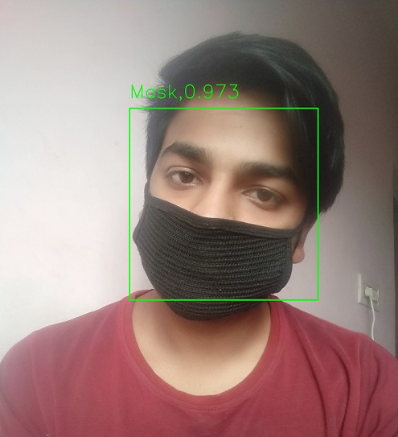

# Covid-19-Face-Mask-Dectector-with-Keras_retinanet
Face Mask detector for covid-19( wuhan virus, chinese virus) with Keras_retinanet

# Installation
- Clone this repository
- Run run ```python setup.py build_ext --inplace```
- Run ```pip install keras_retinanet```

# Testing
- Download the weights from https://drive.google.com/file/d/1W3BxofAORs2fIkKTDv6nTpdvUB9IFgEr/view?usp=sharing and keep it inside the inference folder
- Go to test folder and Execute ```python test.py --image t1.jpg``` inside test folder

# Result


